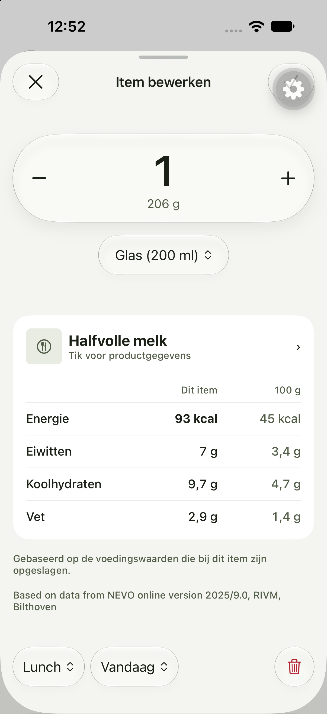

# Labs Diary Entry editor — implementation report

Date: 2026-10-04. Spec: [#91](https://github.com/AppElent/workouts/issues/91).
Comparison point: `42eb27a`. Initial implementation checkpoint: `f037f73`.
Reference: [Round 5](../../designs/entry-editor/round5.html).

The implementation opens through **Settings → Labs**, lists real diary entries
for a selected day, and presents the redesigned editor as a routed sheet. The
existing everyday editor remains available. This was implemented fresh; no code
was copied from `labs/nutrition`.

The slice follows the quantity capsule, grouped native serving menu, logged
calorie delta, product/nutrient card, bottom meal/date/delete controls, and
keyboard-attached creation concept. Existing semantic colors and system type
keep it consistent with Foundry. Native sheet chrome replaces the HTML's simulated
phone chrome. Real NEVO milk is measured in grams: its 200 ml glass is 206 g;
the implementation retains that conversion rather than assuming ml equals g.

**Status:** application implementation and automated verification are complete;
full native acceptance is still pending. The populated Dutch/light sheet and
native serving menu were inspected, but a simulator/host networking failure
blocked completion of keyboard, dismissal, appearance, and accessibility checks.
Do not treat the screenshot or Jest results as approval of those native flows.

## Ownership and files

Paths below are relative to the repository root. Each listed file was created or
changed for this work. “New” identifies files introduced in this slice.

| Files | Placement and responsibility |
| --- | --- |
| `apps/mobile/app/(app)/labs.tsx` (new) | Thin Labs route delegating to its feature screen. |
| `apps/mobile/app/(app)/labs-entry.tsx` (new) | Validates route parameters, loads and retains the initial entry snapshot for one session, handles return navigation. |
| `apps/mobile/app/(app)/labs-food.tsx` (new) | Resolves the food reference and owns navigation for read-only product details. |
| `apps/mobile/app/(app)/_layout.tsx` | Registers routed presentations, including the native editor sheet. |
| `apps/mobile/src/features/nutrition/diary-entry/diary-entry-labs-screen.tsx` (new) | Real-day selection and diary-entry list; unavailable offline days have an explanation. |
| `apps/mobile/src/features/nutrition/diary-entry/diary-entry-editor-screen.tsx` (new) | Editor composition, draft dismissal policy, quantity accessory, native controls, and product navigation. |
| `apps/mobile/src/features/nutrition/diary-entry/use-diary-entry-editor.ts` (new) | One draft owner using TanStack Form/Zod; exact base amount, selection, validation, and existing diary operations. |
| `apps/mobile/src/features/nutrition/diary-entry/diary-entry-serving-popup.tsx` (new) | Creation form, scope selection, validation, independent persistence, and shared keyboard accessory with visible native inputs. It stays with the only subject using this workflow. |
| `apps/mobile/src/features/nutrition/diary-entry/diary-entry-editor-screen.test.tsx` (new) | Colocated route journeys through the existing app-rendering harness. |
| `apps/mobile/src/features/nutrition/food/food-view-screen.tsx` (new) | Read-only source food details, servings, complete nutrients, and attribution; no editor draft. |
| `apps/mobile/src/features/nutrition/components/nutrient-table.tsx` (new) | Shared now by two nutrition subjects: entry snapshot comparison and food viewing. Preserves absent/trace values and domain display precision. |
| `apps/mobile/src/ui/glass-surface.tsx`, `glass-surface.ios.tsx` (new) | Domain-independent material surface: semantic opaque fallback and native iOS glass backdrop. |
| `apps/mobile/src/ui/selection-menu.types.ts`, `selection-menu.tsx`, `selection-menu.ios.tsx` (new) | Generic grouped selection contract, portable modal, and native SwiftUI menu. No feature imports. |
| `apps/mobile/src/theme/tokens.ts` | Named quantity type token for the prominent amount. |
| `apps/mobile/src/i18n/messages/entry-editor.ts` (new), `en.ts`, `nl.ts` | English/Dutch labels, error states, accessible names, and dictionary registration. |
| `apps/mobile/src/data/supplementary-servings.ts` (new) | Account/food subscription, complete pagination, online creation, and offline cached choices. |
| `apps/mobile/src/data/nutrition-local-repository.ts` | SQLite migration and account/food cache; stable supplementary portion identity. Migration is safe when recovering older schemas. |
| `apps/mobile/src/data/nutrition-operation-service.tsx` | Exposes cache reads/writes through the canonical nutrition service and notifies subscribers. |
| `apps/mobile/src/data/nutrition-shortcuts.ts` | Remembers supplementary selections by stable ID rather than catalog index. |
| `apps/mobile/src/screens/nutrition-food-browser.tsx` | Integrates supplementary selection/quick logging and copies complete additions when a real correction Fork is created. Legacy screen remains in place. |
| `apps/mobile/src/screens/nutrition-fork-shipped-food.test.tsx` | Extends the existing correction journey to cover supplementary copying. |
| `apps/mobile/src/screens/settings.tsx` | Adds the localized Labs entry point. |
| `apps/mobile/src/test-support/render-app.tsx` | Registers real Labs routes and allows existing repository seeding at the established app boundary. |
| `apps/mobile/jest.setup.ts` | Native menu substitute now reflects the disabled modifier, enabling meaningful pending-control assertions. |
| `packages/core/src/nutrition/servings.ts`, `index.ts` | Shared supplementary record/selection types and one composition function that filters food ID/unit and preserves ordering. |
| `convex/supplementaryServingTables.ts` (new), `schema.ts` | Separate owner-scoped records keyed by stable shipped-food ID, with owner/food/name indexes. |
| `convex/supplementaryServings.ts` (new) | Authenticated list/create/update/delete with ownership, valid food/unit, unique normalized name, and positive bounded amount checks. |
| `convex/supplementaryServings.test.ts` (new) | Public-operation persistence, isolation, validation, and ownership tests. |
| `convex/_generated/api.d.ts` | Generated binding for the new backend module, produced by Convex tooling. |
| `CONTEXT.md`, `docs/adr/0010-personal-servings-for-shipped-foods.md` (new ADR) | Domain vocabulary and accepted storage/Fork decision. |
| `docs/briefs/diary-entry-editor-redesign.md` (new) | Agreed spec and test boundaries recorded during the design discussion. |
| `apps/mobile/DESIGN_SYSTEM.md`, `docs/mobile-folder-structure.md`, `docs/README.md` | Records this scoped redesign seam, first adoption of feature ownership, and wayfinding. |
| This report and `docs/reports/evidence/diary-entry-editor/ios-nl-light.png` (new) | File-placement rationale, review, verification, and dated visual evidence. |

The subject folders remain flat. There are no separate page/sheet implementations
of the same editor and no second draft hook instance when opening product details.
Existing local-first data operations remain canonical; the new feature does not
introduce another diary persistence layer.

## Reuse and data behavior

- Reuse `GlassSurface` and `SelectionMenu` for domain-independent surfaces and
  grouped choices. Keep workflow rules in feature components.
- Reuse `NutrientTable` for nutrition views with the same missing/trace semantics
  and explicit value/reference headings.
- Reuse the core serving composition at any logging boundary. Supplementary
  records use stable IDs and never pretend to be indexes into shipped data.
- Preserve exact base amounts separately from editable representations. Changing
  an existing representation retains 187.5 exactly; confirmed new definitions
  intentionally select quantity one. Dutch input uses decimal commas.
- A completed creation survives cancellation of the outer entry. Personal Food
  servings use embedded persistence; Shipped Food additions use separate
  account-owned backend records; Personal Measures keep their existing contract.
- Cached choices remain usable offline. Account-synced creation needs a connection.
  A genuine nutrition-correction Fork waits for all online pages and copies the
  additions once into independent embedded records.
- Entry nutrient scaling uses its historical snapshot. Product details display
  current source values separately. Missing source data does not erase history.

## Automated verification

- Root Vitest: **47 suites, 377 tests passed**.
- Final full mobile Jest run: **71 suites, 474 tests passed**. An earlier run
  found a migration-recovery failure when a simulated older schema already
  contained the new cache table. The idempotence fix passed both the affected
  10-test repository suite and the final full run.
- Focused Labs journeys cover exact conversion, Personal Measure creation, dirty
  discard/keep, read-only details/draft return, account-separated cached choices,
  offline creation feedback, meal/date move, validation/retry, popup cancellation,
  Dutch round-trip formatting, pending controls, and independent shipped servings.
- Final Biome and root/mobile TypeScript checks passed after review fixes.
- The affected root Serving/public-backend suites passed again after extraction:
  **2 suites, 19 tests**.
- Production build passed, with existing Vite browser-externalization warnings.

## Native evidence and limits

Context: Foundry development client, runtime hash
`1edb9e8033076972365ddf31023f47a8622ad01c`; iPhone 18 Pro 3 simulator,
iOS 27.0, UDID `FDC60F45-E570-49EA-B217-052D7236A3C9`. Metro belongs to this
worktree on port 8093. Backend is the isolated worktree deployment
`rugged-stork-227.eu-west-1.convex.cloud`; no production writes were performed.

Signed in with the configured development test account, logged a real milk entry,
opened Labs, and inspected the populated Dutch/light editor and native grouped
serving menu. The image below is that initial device checkpoint, before the review
fixes; it establishes populated layout only. The floating gear is development tooling,
not editor chrome.

The creation command exposed native keyboard elements in the accessibility tree,
but the framebuffer stayed at the previous editor frame and the accessory could
not be accepted visually. Later the device daemon stopped responding. Computer
use through Xcode Device Hub recovered UI interaction, but the host began rejecting
IPv4 connections with error 49 (“Can't assign requested address”). Restarting the
task-only simulator did not restore connectivity. Metro was recovered over IPv6
using `REACT_NATIVE_PACKAGER_HOSTNAME=localhost`; Clerk session requests continued
to fail, leaving the app at its pre-existing auth-loading boundary.

**Still required:** keyboard popup attachment and Next/decimal transition, visible
editing/caret behavior, interactive quantity keyboard dismissal, dirty native
swipe and keep/discard, a short navigation/keyboard recording, English and dark
appearance, Dynamic Type XL, and VoiceOver. The final input layout has not been validated natively. Following the review,
the popup uses React Native’s documented sticky-input accessory mode: both
visible text fields share one `InputAccessoryView` without a native ID. This
retains the keyboard-attached design while restoring native caret/selection
controls. The installed React Native source documents this mode in
`Libraries/Components/TextInput/InputAccessoryView.js`. Native transitions
remain an acceptance risk until exercised on-device.

Android acceptance is outside this delivery; portable adapters exist but were not
run on Android. Physical iPhone haptics and tactile feel remain unverified.
The shared browser also failed with an Electron preload/startup error, so the
visual comparison used the provided HTML source and the native screenshot.

## Standards review

The parallel Standards reviewer found two documented issues and one heuristic:
main draft bypassed TanStack Form/Zod, invisible focus fields restricted editing
affordances, and supplementary composition was duplicated. All three code concerns were corrected: the draft uses the required form seam,
composition is shared in core, and the popup has visible native text inputs
inside one sticky accessory. Native behavior must still be accepted before
wider reuse.

## Spec review

The parallel Spec reviewer found three issues: conflicting controls during
creation, a Fork potentially copying an incomplete paginated list, and nonlocalized
Dutch quantity text. All three were corrected and the reviewer rechecked them
without further blocking code findings. No material scope creep was found.

Review totals: Standards **3 initial findings**, corrected in code; Spec **3 initial findings**, all corrected. The outstanding limit is
native acceptance, not a claim that automated tests establish keyboard usability.
