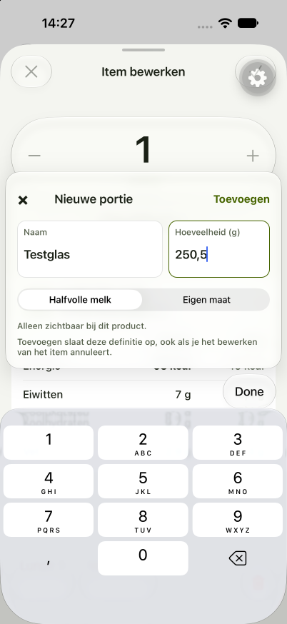

# Labs Diary Entry editor — implementation report

Date: 2026-10-04. Spec: [#91](https://github.com/AppElent/workouts/issues/91).
Comparison point: `42eb27a`. Initial implementation checkpoint: `f037f73`.
Reference: [Round 5](../../../designs/entry-editor/round5.html).

The implementation opens through **Settings → Labs**, lists real diary entries
for a selected day, and presents the redesigned editor as a routed sheet. The
existing everyday editor remains available. This was implemented fresh; no code
was copied from `labs/nutrition`.

The slice follows the quantity capsule, grouped native serving menu,
product/nutrient card, bottom meal/date/delete controls, and
keyboard-attached creation concept. Existing semantic colors and system type
keep it consistent with Foundry. Native sheet chrome replaces the HTML's simulated
phone chrome. Real NEVO milk is measured in grams: its 200 ml glass is 206 g;
the implementation retains that conversion rather than assuming ml equals g.

**Current status:** the Labs slice is implemented, with subsequent native bug fixes
and visual refinements described below. Simulator verification now includes the
populated editor, keyboard shortcuts, portion popup, menu alignment, and native
prominent save action. Full physical-device, accessibility, and cross-platform
acceptance remains incomplete. Earlier verification sections are historical
checkpoints, not a claim that every later revision passed those same checks.

The [retrospective](#retrospective-what-went-wrong-and-what-to-change) records
implementation mistakes, prompt improvements, and proposed design-system and
coding-standard guidance. The retrospective distinguishes proposals from the six improvements adopted in
the follow-up below; other recommendations remain proposals.

## Ownership and files

Paths below are relative to the repository root. Each listed file was created or
changed for this work. “New” identifies files introduced in this slice.

| Files | Placement and responsibility |
| --- | --- |
| `apps/mobile/app/(app)/labs.tsx` (new) | Thin Labs route delegating to its feature screen. |
| `apps/mobile/app/(app)/labs-entry.tsx` (new) | Validates route parameters, loads and retains the initial entry snapshot for one session, handles return navigation. |
| `apps/mobile/app/(app)/labs-food.tsx` (new) | Resolves the food reference and owns navigation for read-only product details. |
| `apps/mobile/app/(app)/_layout.tsx` | Registers routed presentations, including the native editor sheet. |
| `apps/mobile/src/features/nutrition/diary-entry/diary-entry-labs-screen.tsx` (new) | Real-day selection and diary-entry list; unavailable offline days have an explanation. |
| `apps/mobile/src/features/nutrition/diary-entry/diary-entry-editor-screen.tsx` (new) | Editor composition, draft dismissal policy, quantity accessory, native controls, and product navigation. |
| `apps/mobile/src/features/nutrition/diary-entry/diary-entry-quantity.tsx` (new) | Feature-owned quantity dial, replacement editing, and shortcut controls; extracted from screen composition. |
| `apps/mobile/src/features/nutrition/diary-entry/diary-entry-keyboard-overlay.tsx` (new) | One keyboard-positioning owner reused by shortcuts and serving creation within this subject; not yet an app-wide primitive. |
| `apps/mobile/src/features/nutrition/diary-entry/use-diary-entry-editor.ts` (new) | One draft owner using TanStack Form/Zod; exact base amount, selection, validation, and existing diary operations. |
| `apps/mobile/src/features/nutrition/diary-entry/diary-entry-serving-popup.tsx` (new) | Creation form, scope selection, validation, independent persistence, and an app-owned keyboard overlay with visible native inputs. It stays with the only subject using this workflow. |
| `apps/mobile/src/features/nutrition/diary-entry/diary-entry-editor-screen.test.tsx` (new) | Colocated route journeys through the existing app-rendering harness. |
| `apps/mobile/src/features/nutrition/food/food-view-screen.tsx` (new) | Read-only source food details, servings, complete nutrients; no editor draft. Attribution was removed at the user’s request. |
| `apps/mobile/src/features/nutrition/components/nutrient-table.tsx` (new) | Shared now by two nutrition subjects: entry snapshot comparison and food viewing. Preserves absent/trace values and domain display precision. |
| `apps/mobile/src/ui/glass-surface.tsx`, `glass-surface.ios.tsx` (new) | Domain-independent material surface: semantic opaque fallback and native iOS glass backdrop. |
| `apps/mobile/src/ui/selection-menu.types.ts`, `selection-menu.tsx`, `selection-menu.ios.tsx` (new) | Generic grouped selection contract, portable modal, and native SwiftUI menu. No feature imports. |
| `apps/mobile/src/theme/tokens.ts` | Named quantity type token for the prominent amount. |
| `apps/mobile/src/i18n/messages/entry-editor.ts` (new), `en.ts`, `nl.ts` | English/Dutch labels, error states, accessible names, and dictionary registration. |
| `apps/mobile/src/data/supplementary-servings.ts` (new) | Account/food subscription, complete pagination, online creation, and offline cached choices. |
| `apps/mobile/src/data/nutrition-local-repository.ts` | SQLite migration and account/food cache; stable supplementary portion identity. Migration is safe when recovering older schemas. |
| `apps/mobile/src/data/nutrition-operation-service.tsx` | Exposes cache reads/writes through the canonical nutrition service and notifies subscribers. |
| `apps/mobile/src/data/nutrition-shortcuts.ts` | Remembers supplementary selections by stable ID rather than catalog index. |
| `apps/mobile/src/screens/nutrition-food-browser.tsx` | Integrates supplementary selection/quick logging and copies complete additions when a real correction Fork is created. Legacy screen remains in place. |
| `apps/mobile/src/screens/nutrition-fork-shipped-food.test.tsx` | Extends the existing correction journey to cover supplementary copying. |
| `apps/mobile/src/screens/settings.tsx` | Adds the localized Labs entry point. |
| `apps/mobile/src/test-support/render-app.tsx` | Registers real Labs routes and allows existing repository seeding at the established app boundary. |
| `apps/mobile/jest.setup.ts` | Thin substitutes expose native menu selection and header actions to the real app-rendering harness, including disabled state and callbacks. |
| `packages/core/src/nutrition/servings.ts`, `index.ts` | Shared supplementary record/selection types and one composition function that filters food ID/unit and preserves ordering. |
| `convex/supplementaryServingTables.ts` (new), `schema.ts` | Separate owner-scoped records keyed by stable shipped-food ID, with owner/food/name indexes. |
| `convex/supplementaryServings.ts` (new) | Authenticated list/create/update/delete with ownership, valid food/unit, unique normalized name, and positive bounded amount checks. |
| `convex/supplementaryServings.test.ts` (new) | Public-operation persistence, isolation, validation, and ownership tests. |
| `convex/_generated/api.d.ts` | Generated binding for the new backend module, produced by Convex tooling. |
| `CONTEXT.md`, `docs/adr/0010-personal-servings-for-shipped-foods.md` (new ADR) | Domain vocabulary and accepted storage/Fork decision. |
| `docs/product/diary-entry-editor-redesign.md` (new) | Agreed spec and test boundaries recorded during the design discussion. |
| `apps/mobile/DESIGN_SYSTEM.md`, `docs/guidelines/project/mobile-folder-structure.md`, `docs/README.md` | Records this scoped redesign seam, first adoption of feature ownership, and wayfinding. |
| This report and `docs/verification/diary-entry-editor/assets/ios-nl-light.png` (new) | File-placement rationale, review, verification, and dated visual evidence. |

The subject folders remain flat. There are no separate page/sheet implementations
of the same editor and no second draft hook instance when opening product details.
Existing local-first data operations remain canonical; the new feature does not
introduce another diary persistence layer.

## Reuse and data behavior

- Reuse `GlassSurface` and `SelectionMenu` for domain-independent surfaces and
  grouped choices. Keep workflow rules in feature components.
- Reuse `NutrientTable` for nutrition views with the same missing/trace semantics
  and explicit value/reference headings.
- Reuse the core serving composition at any logging boundary. Supplementary
  records use stable IDs and never pretend to be indexes into shipped data.
- Preserve exact base amounts separately from editable representations. Changing
  an existing representation retains 187.5 exactly; confirmed new definitions
  intentionally select quantity one. Dutch input uses decimal commas.
- A completed creation survives cancellation of the outer entry. Personal Food
  servings use embedded persistence; Shipped Food additions use separate
  account-owned backend records; Personal Measures keep their existing contract.
- Cached choices remain usable offline. Account-synced creation needs a connection.
  A genuine nutrition-correction Fork waits for all online pages and copies the
  additions once into independent embedded records.
- Entry nutrient scaling uses its historical snapshot. Product details display
  current source values separately. Missing source data does not erase history.

## Automated verification

- Root Vitest: **47 suites, 377 tests passed**.
- Final full mobile Jest run: **71 suites, 474 tests passed**. An earlier run
  found a migration-recovery failure when a simulated older schema already
  contained the new cache table. The idempotence fix passed both the affected
  10-test repository suite and the final full run.
- Focused Labs journeys cover exact conversion, Personal Measure creation, dirty
  discard/keep, read-only details/draft return, account-separated cached choices,
  offline creation feedback, meal/date move, validation/retry, popup cancellation,
  Dutch round-trip formatting, pending controls, and independent shipped servings.
- Final Biome and root/mobile TypeScript checks passed after review fixes.
- The affected root Serving/public-backend suites passed again after extraction:
  **2 suites, 19 tests**.
- Production build passed, with existing Vite browser-externalization warnings.

## Native evidence and limits

Context: Foundry development client, runtime hash
`1edb9e8033076972365ddf31023f47a8622ad01c`; iPhone 18 Pro 3 simulator,
iOS 27.0, UDID `FDC60F45-E570-49EA-B217-052D7236A3C9`. Metro belongs to this
worktree on port 8093. Backend is the isolated worktree deployment
`rugged-stork-227.eu-west-1.convex.cloud`; no production writes were performed.

Signed in with the configured development test account, logged a real milk entry,
opened Labs, and inspected the populated Dutch/light editor and native grouped
serving menu. The image below is that initial device checkpoint, before the review
fixes; it establishes populated layout only. The floating gear is development tooling,
not editor chrome.

The creation command exposed native keyboard elements in the accessibility tree,
but the framebuffer stayed at the previous editor frame and the accessory could
not be accepted visually. Later the device daemon stopped responding. Computer
use through Xcode Device Hub recovered UI interaction, but the host began rejecting
IPv4 connections with error 49 (“Can't assign requested address”). Restarting the
task-only simulator did not restore connectivity. Metro was recovered over IPv6
using `REACT_NATIVE_PACKAGER_HOSTNAME=localhost`; Clerk session requests continued
to fail, leaving the app at its pre-existing auth-loading boundary.

**Still required:** keyboard popup attachment and Next/decimal transition, visible
editing/caret behavior, interactive quantity keyboard dismissal, dirty native
swipe and keep/discard, a short navigation/keyboard recording, English and dark
appearance, Dynamic Type XL, and VoiceOver. The final input layout has not been validated natively. Following the review,
the popup uses React Native’s documented sticky-input accessory mode: both
visible text fields share one `InputAccessoryView` without a native ID. This
retains the keyboard-attached design while restoring native caret/selection
controls. The installed React Native source documents this mode in
`Libraries/Components/TextInput/InputAccessoryView.js`. Native transitions
remain an acceptance risk until exercised on-device.

Android acceptance is outside this delivery; portable adapters exist but were not
run on Android. Physical iPhone haptics and tactile feel remain unverified.
The shared browser also failed with an Electron preload/startup error, so the
visual comparison used the provided HTML source and the native screenshot.

## Standards review

The parallel Standards reviewer found two documented issues and one heuristic:
main draft bypassed TanStack Form/Zod, invisible focus fields restricted editing
affordances, and supplementary composition was duplicated. All three code concerns were corrected: the draft uses the required form seam,
composition is shared in core, and the popup has visible native text inputs
inside one sticky accessory. Native behavior must still be accepted before
wider reuse.

## Spec review

The parallel Spec reviewer found three issues: conflicting controls during
creation, a Fork potentially copying an incomplete paginated list, and nonlocalized
Dutch quantity text. All three were corrected and the reviewer rechecked them
without further blocking code findings. No material scope creep was found.

Review totals: Standards **3 initial findings**, corrected in code; Spec **3 initial findings**, all corrected. The outstanding limit is
native acceptance, not a claim that automated tests establish keyboard usability.

## Native bug follow-up — 2026-10-04

Retested the same iPhone 18 Pro 3 / iOS 27 simulator using this worktree's existing
Metro on **8084**. The earlier 8093 server is stopped. This follow-up supersedes
the sticky-accessory implementation description above.

- Reproduced the initial unresponsive sheet: tapping plus did nothing. The closed
  date picker still mounted an absolute-fill SwiftUI Host. Returning null while
  closed removes that touch interceptor. The same tap then changed 1 to 1.25 and
  93 to 116 kcal. Serving selection, dirty close/keep, and calendar open/Done worked.
- Reproduced New portion terminating the app. The native SIGABRT trace points to
  `ExpoSwiftUI.HostingView.didMoveToWindow()` while UIKit installs the input
  accessory. The popup now stays inside the app sheet in a keyboard-avoiding
  overlay; its SwiftUI glass and picker no longer move into the keyboard window.
  The offset accounts for the sheet and native header. Verified opening, typing
  `Testglas`, Next to decimal input, entering `250,5`, cancelling, reopening, and
  cancelling again. No serving was saved by this verification.
- Removed explanatory footer and attribution/source copy from the redesigned
  editor and read-only food details, as requested. Domain metadata is unchanged.
- Focused editor/native-adapter tests: **17 passed**. Mobile TypeScript and changed
  TypeScript files' Biome checks passed. Added a regression for the closed date
  picker mounting no overlay. Jest mocks cannot reproduce UIKit window ownership;
  the simulator journey is the crash regression evidence.

Recording: `evidence/diary-entry-editor/ios-keyboard-fix.mp4` captures decimal
editing, cancellation and reopening. Physical-device confirmation, Dynamic Type,
VoiceOver, dark/English appearance, and the remaining gestures are still pending.
The user's subsequent visual review identified fidelity gaps in the quantity
buttons, editing state, menus, keyboard shortcuts, and nutrition card. These fixes
establish usable controls; they do not mark Round 5 visual acceptance complete.

## Round 5 visual follow-up — 2026-10-04

The implementation retains native menus while bringing their composition closer
to the HTML. The user explicitly approved two opt-in type variants in the shared
theme; this does not imply acceptance of every remaining native menu difference. Existing theme values and other screens' typography remain unchanged.

- `diary-entry/diary-entry-quantity.tsx` owns the 84-point circular step buttons,
  44-point quantity, faded replacement placeholder, and rounded keyboard presets
  with an accent-filled Done/Klaar action. Focusing without typing preserves the
  previous quantity; presets dismiss the keyboard. Presets wrap when necessary
  so Done remains reachable.
- `diary-entry/diary-entry-keyboard-overlay.tsx` shares keyboard positioning between
  quantity shortcuts and serving creation. Native accessory attachment was not
  reliable on the installed build, so both stay in the app's view hierarchy. The
  shortcut overlay observes keyboard events before focus. This also preserves
  the earlier SwiftUI window-ownership crash fix.
- `diary-entry-editor-screen.tsx` composes those pieces and tightens card spacing,
  header size, and separators. Native menus keep system grouping/checkmarks.
- `components/nutrient-table.tsx` adds an opt-in compact presentation: 14-point
  rows, narrower numeric columns and less header whitespace. Other callers retain
  their previous presentation. Columns adapt for larger accessibility sizes.
- `theme/tokens.ts` adds `quantityCompact` and `table`, used only by the opted-in
  editor. This was the only shared-theme addition discussed and approved.
- `use-diary-entry-editor.ts` now resets a newly selected named Serving to **1**,
  or g/ml to **100**, and reselecting the current option does nothing. This
  intentionally supersedes the earlier exact-amount-preserving selection contract.
  The original historical snapshot remains unchanged until a draft edit is saved.
  App-rendering tests were updated for this new behavior and empty-focus dismissal.

Native checks on the same simulator/backend and Metro **8084**: distinct step
buttons; faded focus state; preset 2 updates the draft and dismisses the keyboard;
Gram resets to 100 with matching calories; empty editing plus Klaar preserves
100; Beker resets to 1; Dutch/light layout at Large and Extra Large text sizes.
Text size was restored to Large afterward. Evidence:

- `evidence/diary-entry-editor/ios-quantity-keyboard-round5.png`
- `evidence/diary-entry-editor/ios-gram-keyboard-round5.png`
- `evidence/diary-entry-editor/ios-round5-xl.png`
- `evidence/diary-entry-editor/ios-round5-visual.mp4`

The system keyboard, menus, and sheet chrome intentionally retain native styling.
The shortcut pills use native glass surfaces on iOS. This pass does not claim
physical-iPhone, VoiceOver, Android, or complete English/dark acceptance.

The follow-up removes the logged-amount comparison and Personal Measure helper
caption between the serving selector and product card; invalid-quantity feedback
remains. The save icon uses the accent green when the draft is dirty. The editor
app-rendering suite passes (13 tests), and mobile TypeScript passes after these
changes. These checks do not establish physical-device visual acceptance.

### Save fill and portion popup refinement

`diary-entry-editor-screen.tsx` now fills the dirty save action with the existing
lime `accentFill` and uses `onAccent` for its checkmark, instead of tinting only
the glyph. No global palette changes were needed.
`diary-entry-serving-popup.tsx` reduces field and card padding, uses the compact
control typography, fills the Add action with the same primary color, and removes
the saved-separately footer. Native inputs retain cursor/selection behavior and
44-point input targets; scope help and validation feedback remain.

Verified the filled dirty action and opened the revised popup above the native
keyboard on iPhone 18 Pro 3 / iOS 27, Dutch/light, Metro 8084. Evidence:
`evidence/diary-entry-editor/ios-compact-serving-popup.png`.
The editor's 13 app-rendering tests and mobile typecheck pass. Physical-iPhone
acceptance remains with the user; no new serving was persisted during this check.

The save action now uses the iOS native header item (`variant: prominent` when
dirty, `plain` when clean), with an explicit accessible name. UIKit applies the
lime tint to the glass itself. This supersedes the initial React Native circle
inside the toolbar's separate glass background. The React Native header action
remains the non-iOS fallback. Verified the single native shape in the running
simulator; evidence: `evidence/diary-entry-editor/ios-native-prominent-save.png`.

## Retrospective: what went wrong and what to change

### What I did wrong

The repeated corrections were not simply the cost of adapting HTML to iOS.
Several were avoidable implementation and verification mistakes. The user had
already asked for close fidelity and guidance when a design conflicted with the
platform. I should have identified those differences before calling the first
implementation complete.

| Mistake | Cause and consequence | Better approach |
| --- | --- | --- |
| Delivered a behaviorally working editor with visibly different hierarchy | I reused existing sizes and controls without a systematic comparison against Round 5. Quantity size, distinct step buttons, menu alignment, keyboard actions, card spacing, and popup density drifted. | Extract a small visual contract from the reference, then compare the populated native screen against it before reporting completion. |
| Left an invisible native DatePicker host mounted | A full-screen native host intercepted touches even while the picker was closed. Opening an entry appeared to lock the sheet. | Unmount inactive full-screen native presentations; verify that the initial screen remains tappable before testing deeper flows. |
| Put SwiftUI-backed glass inside `InputAccessoryView` | The installed runtime crashed when UIKit moved the host into its keyboard window. The HTML’s example code was treated as more production-ready than it was. | Treat design snippets as intent, inspect native ownership, and spike the highest-risk keyboard/native composition early on the actual development build. |
| Changed the sheet detent without rechecking its keyboard geometry | The old keyboard offset no longer matched native sheet expansion, leaving shortcut numbers far above the keyboard. A separate native layout issue also hid the ScrollView until its wrapper was retained. | Verify detent changes together with keyboard open/close, safe areas, scrolling, and fresh reopening. Give keyboard placement one owner. Document native workarounds at the implementation site. |
| Used a custom colored circle inside native toolbar glass | Tinting the glyph first did not meet the requested fill. Adding a React Native background then produced a round fill inside a wider native glass container. | Use native toolbar semantics (`prominent`) and tint the native control; inspect the whole composed result rather than the local view’s styles. |
| Explained the native-toolbar correction without applying it | My response sounded like resolution while the running app was unchanged. | Distinguish a recommendation from an applied change. For an ongoing fix, implement and verify before saying it is fixed. |
| Treated native menus as sufficient explanation for visual differences | Checked and unchecked choices were composed differently, causing label indentation to shift. This was fixable with native selection controls. | Use the same native selection row type for selected and unselected options. Separate actual platform constraints from mistakes in composition. |
| Made the portion form too large and its primary action too weak | Large input minimum heights plus surrounding padding accumulated; Add was only colored text. Extra explanatory copy increased density. | Measure the whole field and popup, retain usable input targets, use the primary filled action, and include only useful contextual help. |
| Kept exact amount when changing servings, producing awkward fractions | This was the earlier interaction contract, but it was not reconciled with the desired everyday editing behavior soon enough. | Explicitly define what changing units/servings means. The final approved behavior resets named servings to 1 and g/ml to 100; reselecting the current option does nothing. |
| Let native adapters outpace the test harness | The menu Toggle initially lacked a test substitute; native toolbar items later disappeared from the React-only test tree. | Maintain thin native-boundary substitutes for semantics and callbacks as adapters change. Keep real navigation and feature logic in the journey tests; do not disable native behavior in production just to make tests pass. |
| Allowed the report to accumulate stale descriptions | Early attribution, logged-delta, keyboard, and verification descriptions remained after follow-up changes. | Keep one current-state summary and clearly dated historical evidence. Update documentation in the same pass as a changed contract. |

The nutrition database version issue also showed why runtime state matters:
version 7 data had to be recognized as compatible. A working branch or an
assumption that a fix is on main does not prove the running worktree contains it.
Check the actual source, installed client, Metro process, and database contract.

### What belongs in the design system

These are proposed additions to `apps/mobile/DESIGN_SYSTEM.md`, with implementation
contracts in `src/ui/` and values in `src/theme/tokens.ts`. Some are already
partially documented; consolidate them instead of adding duplicate rules.

1. **Native chrome owns its shape and material.** For navigation actions, use
   native bar items and semantic styles. A primary confirmation uses a prominent
   native item with the accent tint. Do not paint an independent filled shape
   inside an already styled glass toolbar item. Define clean, dirty, invalid,
   pending, and disabled states explicitly.
2. **Separate chrome from content.** Native menus, sheet chrome, and transient
   controls use platform material. Product cards and input content use semantic
   surfaces. Glass should express a control layer, not decorate every container.
3. **Document approved density variants.** Keep 44-point quantity and 14-point
   nutrient rows as named opt-in variants. Do not change the global type scale to
   match one prototype. Distinguish visual size from touch-target size and check
   Dynamic Type before making compact variants defaults.
4. **Specify selection-menu anatomy.** Selected and unselected rows share label
   alignment; checks occupy a consistent native slot. Define section labels,
   separators, and the add action. Native menus may limit custom label styling:
   show the actual result before promising exact HTML typography. The current
   New portion action has a green plus; full bold/accent label fidelity has not
   been established and should not be marked complete.
5. **Define compact creation forms.** Use visible labels, native editable inputs,
   semantic focus/error colors, a clearly filled primary action, and one useful
   scope explanation. Avoid stacked explanatory footers. Check the form with the
   longest supported translation, both keyboards, and validation errors.
6. **Define quantity replacement behavior.** On focus, the old value becomes a
   faded replacement hint; empty dismissal preserves it. Presets and step buttons
   have explicit effects. Serving reset rules remain nutrition behavior, rather
   than becoming a generic numeric-input rule.
7. **Specify sheet and keyboard acceptance together.** A preferred opening
   height, expansion behavior, shortcut position, dismissal, and scroll ownership
   form one interaction contract. The current 0.9/1 detents are this editor’s
   trial, not a universal sheet default.

The keyboard overlay should remain feature-owned until a second real consumer
outside this subject needs the same contract. Its installed-runtime restriction
on SwiftUI hosts inside `InputAccessoryView` is a compatibility note, not a claim
that all native accessory APIs are inherently unusable.

### What belongs in general agent guidance

Suggested additions to general implementation/verification guidance:

- When the task says “stay close to the design,” inspect every interactive state
  shown by the reference, including open menus and keyboard states. A screenshot
  of the initial screen is not enough.
- Before implementation, record which details are exact targets, which use native
  equivalents, and which need discussion. Explain meaningful deviations early;
  routine implementation decisions do not need repeated permission requests.
- Verify the highest-risk native integration first. For this slice that meant
  opening the sheet, editing a quantity, opening New portion, moving between
  keyboards, and dismissing without losing the draft.
- Pair behavioral tests with visual evidence. Tests establish data and state
  behavior; simulator/device inspection establishes layout and interaction.
  Neither substitutes for the other.
- After changing presentation geometry or a native adapter, revisit the affected
  journey rather than checking only the altered component.
- Report “implemented,” “automatically checked,” “observed on simulator,” and
  “accepted on physical device” separately. Never describe an explanation or
  proposed patch as an applied fix.
- Verify the active worktree, Metro port, backend, and native build before testing.
  Reuse the user’s correct running server and avoid unnecessary process restarts.
- When a user reports a mismatch, compare it to the reference and inspect the
  native composition before declaring it a platform limitation.

These rules strengthen execution, not approval bureaucracy. The agent should
continue authorized work and ask only about material design trade-offs.

### What belongs in coding standards and folder guidance

The existing [folder contract](../../guidelines/project/mobile-folder-structure.md) is mostly the right
one. The lesson is to enforce ownership, not to introduce more folder layers.

| Boundary | Rule to retain or clarify | Example from this implementation |
| --- | --- | --- |
| Routes | Keep URL parameters, loading/session entry, and navigator presentation in `app/`; delegate feature UI. | `labs-entry.tsx` opens one editing session; `_layout.tsx` declares sheet detents. |
| Subject | Colocate screen, draft hook, subject-specific controls, and tests in a flat subject folder. Extract by responsibility, not arbitrary line count. | `diary-entry/` owns quantity editing, serving creation, keyboard coordination, and the journey test. |
| Feature reuse | Promote a component to `features/<feature>/components/` when another subject uses the same domain-aware contract. | `nutrient-table.tsx` serves entry and food views. |
| App-wide UI | Keep platform adapters and domain-free contracts in `src/ui/`; they must not import nutrition features. | `SelectionMenu` and `GlassSurface`, including their `.ios.tsx` implementations. |
| Theme | Keep all font sizes and semantic colors in shared tokens; add scoped variants instead of inline magic values or global restyling. | `quantityCompact`, `table`, `accentFill`, and `onAccent`. |
| Domain and persistence | Reuse canonical data services and shared calculations. UI presentation changes should not create alternative persistence or conversion logic. | Diary operations remain in the service; shared serving calculations remain in `packages/core`. |
| Tests | Colocate behavior tests with their owner; keep native-boundary substitutes in test support. Exercise public backend operations for persistence/isolation. | Editor journey tests and supplementary-serving public-operation tests. |
| View versus edit | Separate saved-data viewing from draft ownership. Page versus sheet is presentation, not automatically a new feature or duplicate form. | Food viewing is independent; one entry draft survives navigation to details and back. |

Additional coding guidance worth making explicit:

- Give each draft, keyboard offset, scroll container, and dismissal policy one
  owner. Two hooks with the same name do not share state; two inset adjustments
  can double-count the same native movement.
- Prefer semantic platform APIs over visual patches when the platform owns the
  surrounding control. Use the public native-item API before adding another
  custom background or nested native host.
- Unmount inactive native overlays that otherwise occupy the interaction plane.
  Test opening the parent with no auxiliary sheet active.
- Document compatibility workarounds with the observed runtime and a reason.
  Do not promote a one-build workaround to a universal architecture rule.
- Keep filenames descriptive and kebab-case, preserve basenames for tests and
  platform variants, and avoid generic `helpers`, `common`, or presentation-only
  folder splits without an ownership reason.
- Review the complete final diff against the fixed starting point and spec, but
  also update changed interaction contracts when user feedback supersedes the
  original spec. Do not silently keep contradictory behavior descriptions.

### A reusable prompt improvement

The original prompt already requested close fidelity, reusable patterns, folder
ownership, and guidance. The following makes the acceptance process more explicit;
it does not excuse the implementation misses above:

> Implement this design as the first reusable feature slice using the documented
> folder structure. Before coding, extract a compact visual and interaction
> checklist from every state in the HTML, including menus, dirty/disabled states,
> keyboard, and nested creation. Identify native equivalents and discuss material
> deviations; treat example code as illustrative, not production-ready. Use native
> APIs for navigation chrome and semantic theme tokens for content. Verify the
> risky sheet/keyboard flow early on the running development client. Before reporting
> completion, compare the populated native result with the reference, capture
> evidence, and distinguish automated checks from device acceptance. Update one
> report with file ownership, deviations, unresolved issues, and lessons that could
> become shared guidance. Do not globally restyle other screens without discussion.

### Remaining acceptance and follow-up

- Physical-iPhone acceptance of final toolbar, popup, keyboard spacing, and sheet
  feel remains with the user; the latest observations in this report are simulator
  observations.
- Native menu New portion text styling still needs an explicit fidelity decision;
  the green plus alone is not proof that the requested bold/accent row was achieved.
- Full English/dark, VoiceOver, and Android acceptance is not claimed. Earlier
  Large/Extra Large observations should not be treated as coverage of every later
  popup and toolbar revision.
- Recommendations beyond the six adopted improvements below remain proposals;
  the retrospective is not itself the canonical source of project rules.

Latest verification after the native toolbar adapter change: all **71 mobile
suites / 480 tests** pass, mobile TypeScript passes, and `git diff --check` passes.
The native header test substitute exposes native button callbacks and disabled
state while retaining the real navigation stack. These automated checks do not
resolve the visual/device acceptance items above.

## Adopted retrospective improvements — 2026-10-05

The user authorized all six environment improvements, with visual comparison
required specifically when implementing a supplied design/mockup. These are
project-owned changes; installed global skills and managed shared guidelines
were not edited.

| Improvement | Canonical destination and change |
| --- | --- |
| Reference comparison | `.claude/skills/verify/SKILL.md`: conditional state checklist, current reference-comparison evidence, explicit unresolved coverage, and reviewer completion criteria. `apps/mobile/DESIGN_SYSTEM.md` points to it. Ordinary UI work retains normal verification without requiring a mockup checklist. |
| Early native integration verification | The same verification guide: exercise the minimal overlay/sheet/keyboard flow before polishing, and repeat it when geometry or adapters change. |
| Native control ownership | `apps/mobile/DESIGN_SYSTEM.md`: platform-owned toolbar material/shape, semantic prominence, save states, and a link to the implemented editor example. |
| Automated architecture checks | `scripts/check-mobile-architecture.mjs` and its colocated tests, wired into `pnpm check` and therefore existing CI. Direct UI-to-feature dependencies use TypeScript resolution; feature filenames and literal font sizes are checked syntactically. The folder contract documents adoption scope and limitations. |
| Navigation and review ownership | The verification guide points to `docs/guidelines/project/mobile-folder-structure.md` instead of assuming all screens live in the legacy directory. The project-owned section of `CODING_STANDARDS.md` assigns semantic ownership review. AGENTS.md remains unchanged. |
| Tool output and report discipline | The verification guide owns concise diagnostic-log inspection, source-map filtering, and one current report status with historical evidence labeled. |

Naming and font enforcement applies to adopted feature folders; existing generic
UI typography and legacy screens are not newly required to migrate. The check
covers direct dependencies and literal syntax, not transitive graphs or computed
style values. Choosing a shared component's owner remains a review decision.
